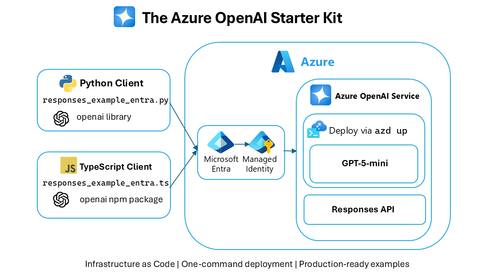

<!--
---
page_type: sample
languages:
- python
- typescript
- go
- dotnet
products:
- azure-openai
- azure
urlFragment: azure-openai-starter
name: The Azure OpenAI Starter Kit
description: Deploy Azure OpenAI with GPT-5-mini using one CLI command. Includes OpenAI SDK for Python, TypeScript and Go examples using the Responses API.
---
-->
# The Azure OpenAI Starter Kit

**The fastest way to get started with Azure OpenAI.**

Rapidly deploy an Azure OpenAI instance with a GPT-5-mini model using a single CLI command. Includes OpenAI SDK for Python, TypeScript, Go and .NET examples using the Responses API.

## Architecture Overview



*The Azure OpenAI Starter Kit provides Infrastructure as Code deployment with one-command setup and production-ready client examples for Python, TypeScript, Go and .NET, featuring secure EntraID authentication and the new Responses API optimized for GPT-5-mini.*

## Prerequisites

✅ [Azure Subscription](https://azure.microsoft.com/pricing/purchase-options/azure-account)
✅ [Azure Developer CLI](https://learn.microsoft.com/azure/developer/azure-developer-cli/install-azd)
✅ [Azure CLI](https://learn.microsoft.com/cli/azure/install-azure-cli)

## Quick Start

```bash
# 1. Login to Azure - both Azure CLI and Azure Developer CLI
az login
azd auth login

# 2. Deploy GPT-5-mini to Azure OpenAI 
azd up
```

That's it! 🚀 You now have **Azure OpenAI** with **GPT-5-mini** model deployed and ready to use!

## Next Steps

### Option A: Keyless Authentication (Recommended) 🔐

**Use keyless authentication with Azure Identity - the secure, production-ready approach.**

<details>
<summary><strong>Click to expand Keyless setup and code examples</strong></summary>

#### Setup Steps

<details open>
<summary><strong>zsh/bash</strong></summary>

```bash
# 1. Get your endpoint
endpoint=$(azd env get-value 'AZURE_OPENAI_ENDPOINT')

# 2. Set environment variable
export AZURE_OPENAI_ENDPOINT=$endpoint

# 3. Assign yourself the OpenAI User role
userId=$(az ad signed-in-user show --query id -o tsv)
resourceId="/subscriptions/$(az account show --query id -o tsv)/resourceGroups/rg-$(azd env get-value 'AZURE_ENV_NAME')/providers/Microsoft.CognitiveServices/accounts/$(azd env get-value 'AZURE_OPENAI_NAME')"
az role assignment create --role "Cognitive Services OpenAI User" --assignee $userId --scope $resourceId

# 4. Run EntraID examples
cd src/python && python responses_example_entra.py
# or
cd src/typescript && tsx responses_example_entra.ts
# or
cd src/go && go run .
# or
cd src/dotnet && dotnet run responses_example_entra.cs
```

</details>

<details>
<summary><strong>PowerShell</strong></summary>

```powershell
# 1. Get your endpoint
$endpoint = azd env get-value 'AZURE_OPENAI_ENDPOINT'

# 2. Set environment variable
$env:AZURE_OPENAI_ENDPOINT=$endpoint

# 3. Assign yourself the OpenAI User role
$userId = az ad signed-in-user show --query id -o tsv
$resourceId = "/subscriptions/$(az account show --query id -o tsv)/resourceGroups/rg-$(azd env get-value 'AZURE_ENV_NAME')/providers/Microsoft.CognitiveServices/accounts/$(azd env get-value 'AZURE_OPENAI_NAME')"
az role assignment create --role "Cognitive Services OpenAI User" --assignee $userId --scope $resourceId

# 4. Run EntraID examples
cd src/python && python responses_example_entra.py
# or
cd src/typescript && tsx responses_example_entra.ts
# or
cd src/go && go run .
# or
cd src/dotnet && dotnet run responses_example_entra.cs
```

</details>

> **NOTE**: If your Azure account is bound with more than one Azure tenant, you should specify the tenant ID before running the app; otherwise you'll get an authentication error.
>
> ```bash
> # zsh/bash
> export AZURE_TENANT_ID=$(az account show --query "tenantId" -o tsv)
>
> # PowerShell
> $env:AZURE_TENANT_ID = az account show --query "tenantId" -o tsv
> ```

#### Code Samples

<details>
<summary><strong>Python Code:</strong></summary>

```python
from openai import OpenAI
from azure.identity import DefaultAzureCredential, get_bearer_token_provider

token_provider = get_bearer_token_provider(
    DefaultAzureCredential(),
    "https://cognitiveservices.azure.com/.default"
)

client = OpenAI(
    base_url=f"{os.getenv('AZURE_OPENAI_ENDPOINT')}openai/v1/",
    api_key=token_provider
)

response = client.responses.create(
    model="gpt-5-mini",
    input="Explain quantum computing in simple terms",
    max_output_tokens=1000
)
print(response.output_text)
```

</details>

<details>
<summary><strong>TypeScript Code:</strong></summary>

```typescript
import OpenAI from "openai";
import { DefaultAzureCredential, getBearerTokenProvider } from "@azure/identity";

const tokenProvider = getBearerTokenProvider(
    new DefaultAzureCredential(),
    "https://cognitiveservices.azure.com/.default"
);

const client = new OpenAI({
    baseURL: `${process.env.AZURE_OPENAI_ENDPOINT}openai/v1/`,
    apiKey: tokenProvider as any
});

const response = await client.responses.create({
    model: "gpt-5-mini",
    input: "Explain quantum computing in simple terms",
    max_output_tokens: 1000
});
console.log(response.output_text);
```

</details>

<details>
<summary><strong>Go Code:</strong></summary>

```go
import (
    "github.com/Azure/azure-sdk-for-go/sdk/azidentity"
    "github.com/openai/openai-go/v3"
    "github.com/openai/openai-go/v3/azure"
    "github.com/openai/openai-go/v3/option"
    "github.com/openai/openai-go/v3/responses"
)

cred, err := azidentity.NewDefaultAzureCredential(nil)

if err != nil {
    log.Fatalf("Failed to create DefaultAzureCredential: %s", err)
}

const scope = "https://cognitiveservices.azure.com/.default"

// Initialize OpenAI client with Azure endpoint and the token
client := openai.NewClient(
    option.WithBaseURL(endpoint+"/openai/v1/"),
    azure.WithTokenCredential(cred, azure.WithTokenCredentialScopes([]string{scope})),
)

resp, err := client.Responses.New(context.TODO(), responses.ResponseNewParams{
    Model: "gpt-5-mini",
    Input: responses.ResponseNewParamsInputUnion{
        OfString: openai.String("Explain quantum computing in simple terms"),
    },
    MaxOutputTokens: openai.Int(1000),
})
```

</details>

<details>
<summary><strong>.NET Code:</strong></summary>

```csharp
#!/usr/bin/dotnet run

#:package OpenAI@2.*
#:package Azure.Identity@1.*

using System.ClientModel.Primitives;
using Azure.Identity;
using OpenAI;
using OpenAI.Responses;

#pragma warning disable OPENAI001

var policy = new BearerTokenPolicy(new DefaultAzureCredential(), "https://cognitiveservices.azure.com/.default");
var clientOptions = new OpenAIClientOptions
{
    Endpoint = new Uri($"{Environment.GetEnvironmentVariable("AZURE_OPENAI_ENDPOINT")!.TrimEnd('/')}/openai/v1/"),
    
};

var responseClient = new OpenAIResponseClient("gpt-5-mini", policy, clientOptions);
var responseCreationOptions = new ResponseCreationOptions
{
    MaxOutputTokenCount = 1000
};

var response1 = await responseClient.CreateResponseAsync(
    userInputText: "Explain quantum computing in simple terms",
    options: responseCreationOptions);

Console.WriteLine(response1.Value.GetOutputText());
```

</details>

**Why Keyless?**

✅ No API keys to manage or rotate  
✅ Better security with Azure RBAC  
✅ Works with your Azure login  
✅ Production-ready and enterprise-grade

</details>

---

### Option B: API Key Authentication (Quick Start)

**For quick testing and development:**

<details>
<summary><strong>Click to expand API key setup and code examples</strong></summary>

#### Setup Steps

<details open>
<summary><strong>zsh/bash</strong></summary>

```powershell
# 1. Get your endpoint
endpoint=$(azd env get-value 'AZURE_OPENAI_ENDPOINT')

# 2. Get your API key
apiKey=$(az cognitiveservices account keys list --name $(azd env get-value 'AZURE_OPENAI_NAME') --resource-group rg-$(azd env get-value 'AZURE_ENV_NAME'))

# 3. Set environment variables
export AZURE_OPENAI_ENDPOINT=$endpoint
export AZURE_OPENAI_API_KEY=$apiKey

# 4. Run API key examples
cd src/python && python responses_example.py
# or
cd src/typescript && npm start
# or
cd src/go && go run .
# or
cd src/dotnet && dotnet run responses_example.cs
```

</details>

<details>
<summary><strong>PowerShell</strong></summary>

```powershell
# 1. Get your endpoint
$endpoint = azd env get-value 'AZURE_OPENAI_ENDPOINT'

# 2. Get your API key
$apiKey = az cognitiveservices account keys list --name $(azd env get-value 'AZURE_OPENAI_NAME') --resource-group rg-$(azd env get-value 'AZURE_ENV_NAME')

# 3. Set environment variables
$env:AZURE_OPENAI_ENDPOINT=$endpoint
$env:AZURE_OPENAI_API_KEY=$apiKey

# 4. Run API key examples
cd src/python && python responses_example.py
# or
cd src/typescript && npm start
# or
cd src/go && go run .
# or
cd src/dotnet && dotnet run responses_example.cs
```

</details>

#### Code Samples

<details>
<summary><strong>Python Code:</strong></summary>

```python
from openai import OpenAI

client = OpenAI(
    api_key=os.getenv("AZURE_OPENAI_API_KEY"), 
    base_url=f"{os.getenv('AZURE_OPENAI_ENDPOINT')}openai/v1/"
)

response = client.responses.create(
    model="gpt-5-mini",
    input="Explain quantum computing in simple terms",
    max_output_tokens=1000
)
print(response.output_text)
```

</details>

<details>
<summary><strong>TypeScript Code:</strong></summary>

```typescript
import OpenAI from 'openai';

const client = new OpenAI({
    apiKey: process.env.AZURE_OPENAI_API_KEY,
    baseURL: `${process.env.AZURE_OPENAI_ENDPOINT}openai/v1/`
});

const response = await client.responses.create({
    model: "gpt-5-mini",
    input: "Explain quantum computing in simple terms",
    max_output_tokens: 1000
});
console.log(response.output_text);
```

</details>

<details>
<summary><strong>Go Code:</strong></summary>

```go
import (
    "github.com/Azure/azure-sdk-for-go/sdk/azidentity"
    "github.com/openai/openai-go/v3"
    "github.com/openai/openai-go/v3/azure"
    "github.com/openai/openai-go/v3/option"
    "github.com/openai/openai-go/v3/responses"
)

client := openai.NewClient(
    option.WithBaseURL(endpoint+"/openai/v1/"),
    option.WithAPIKey(apiKey),
)

resp, err := client.Responses.New(context.TODO(), responses.ResponseNewParams{
    Model: "gpt-5-mini",
    Input: responses.ResponseNewParamsInputUnion{
        OfString: openai.String("Explain quantum computing in simple terms"),
    },
    MaxOutputTokens: openai.Int(1000),
})
```

</details>

<details>
<summary><strong>.NET Code:</strong></summary>

```csharp
#!/usr/bin/dotnet run

#:package OpenAI@2.*

using System.ClientModel;
using OpenAI;
using OpenAI.Responses;

#pragma warning disable OPENAI001

var credential = new ApiKeyCredential(Environment.GetEnvironmentVariable("AZURE_OPENAI_API_KEY"));
var clientOptions = new OpenAIClientOptions
{
    Endpoint = new Uri($"{Environment.GetEnvironmentVariable("AZURE_OPENAI_ENDPOINT").TrimEnd('/')}/openai/v1/")
};
var responseClient = new OpenAIResponseClient("gpt-5-mini", credential, clientOptions);
var responseCreationOptions = new ResponseCreationOptions
{
    MaxOutputTokenCount = 1000
};

var response1 = await responseClient.CreateResponseAsync(
    userInputText: "Explain quantum computing in simple terms",
    options: responseCreationOptions);

Console.WriteLine($"Response: {response1.Value.GetOutputText()}");
```

</details>

</details>

---

**📖 See [CLIENT_README.md](CLIENT_README.md) for detailed setup guide with more examples**

## What This Template Includes

- **Core Infrastructure**: Azure OpenAI resource with GPT-5-mini deployment
- **Optimal Configuration**: Flexible region selection, GlobalStandard SKU, v1 API
- **Secure Authentication**: EntraID (Azure Identity) recommended + API key option
- **Client Examples**: Python, TypeScript and Go using the new Responses API
- **Validation Scripts**: PowerShell and Bash scripts for testing
- **Complete Documentation**: Setup guides and troubleshooting tips

## What You Get

✅ **GPT-5-mini (2025-08-07)** - Latest reasoning model, no registration required  
✅ **Flexible region** deployment - Choose your optimal region   
✅ **New v1 API** support - Future-proof, no version management needed  
✅ **Automatic deployment** - Model ready to use immediately  
✅ **Multi-language examples** - Python, TypeScript/Node.js and Go clients  
✅ **Two authentication methods** - API keys (quick start) + EntraID (production-ready)  
✅ **Unique resource naming** - No conflicts with existing resources  

## Template Structure

```text
├── azure.yaml                 # azd configuration
├── infra/
│   ├── main.bicep             # Main deployment template
│   ├── main.parameters.json   # Deployment parameters
│   └── resources.bicep        # Azure OpenAI resource definition
├── src/
│   ├── dotnet/
│   │   ├── responses_example.cs         # API key authentication
│   │   ├── responses_example_entra.cs   # EntraID authentication
│   │   ├── global.json                  # .NET SDK configuration
│   │   └── README.md                    # .NET prerequisites
│   ├── go/
│   │   ├── responses_example
│   │   |   ├── main.go                  # API key authentication
│   │   |   ├── go.mod                   # Go module dependencies
│   │   |   └── go.sum                   # Go dependency checksums
│   │   └── responses_example_entra
│   │   |   ├── main.go                  # EntraID key authentication
│   │   |   ├── go.mod                   # Go module dependencies
│   │   |   └── go.sum                   # Go dependency checksums
│   ├── python/
│   │   ├── responses_example.py         # API key authentication
│   │   ├── responses_example_entra.py   # EntraID authentication
│   │   └── requirements.txt             # Python dependencies
│   └── typescript/
│       ├── responses_example.ts         # API key authentication
│       ├── responses_example_entra.ts   # EntraID authentication
│       ├── package.json                 # Node.js dependencies
│       └── tsconfig.json                # TypeScript configuration
├── CLIENT_README.md           # Detailed setup guide (Python & TypeScript)
├── validate.ps1              # PowerShell validation script
└── validate.sh               # Bash validation script
```

## Common Commands

```bash
# Redeploy with changes
azd up

# See what would be deployed
azd provision --preview  

# Debug deployment issues
azd up --debug

# Clean up everything  
azd down
```

## Alternative Regions

Want to deploy to East US 2 instead?

```bash
azd env set AZURE_LOCATION eastus2
azd up
```

## Model Customization

Want a different model? Edit `infra/resources.bicep`:

```bicep
// Current: GPT-5-mini (no registration required)
gptModelName: 'gpt-5-mini'
gptModelVersion: '2025-08-07'

// Alternatives (no registration required):
gptModelName: 'gpt-5-nano'      // Fastest
gptModelName: 'gpt-5-chat'      // Chat-optimized

// Full GPT-5 (requires registration):
gptModelName: 'gpt-5'           // Needs approval
```

## Troubleshooting

**"GPT-5-mini not available"** → Try `azd env set AZURE_LOCATION eastus2`

**"Quota exceeded"** → Check your subscription quota for Azure OpenAI

**"Permission denied"** → Ensure you have Cognitive Services Contributor role

**"Tenant provide token mismatch"** → Set `AZURE_TENANT_ID` environment variable with the proper tenant ID.

**Need debug info?** → Run `azd up --debug` for detailed logs

## Why This Template?

✅ **Minimal setup** - 2 commands instead of 20+  
✅ **Latest model** - GPT-5-mini with reasoning capabilities  
✅ **Future-proof** - Uses new v1 API, no version management  
✅ **Production-ready** - GlobalStandard SKU, EntraID auth, proper naming  
✅ **Complete examples** - Python, TypeScript and Go with error handling  
✅ **Secure by default** - Supports keyless authentication with Azure Identity  
✅ **Easy cleanup** - Remove everything with `azd down`  

---

**Happy AI building with GPT-5-mini!** 🤖✨

*Powered by [Azure Developer CLI](https://aka.ms/azd) | Deploys GPT-5-mini (2025-08-07)*
