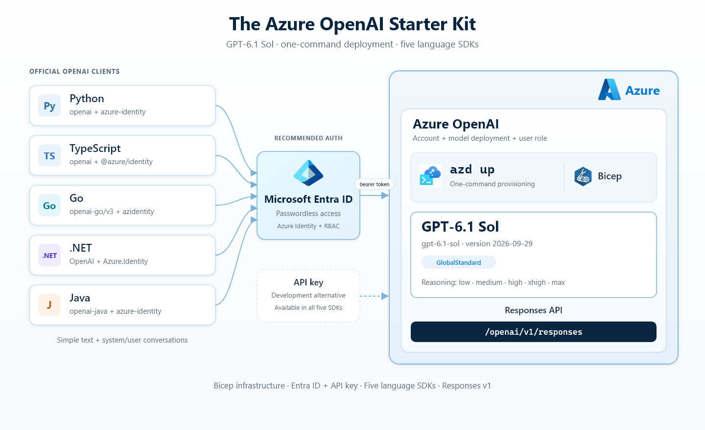

<!--
---
page_type: sample
languages:
- python
- typescript
- go
- csharp
- java
products:
- azure-openai
- azure
urlFragment: azure-openai-starter
name: The Azure OpenAI Starter Kit
description: Deploy Azure OpenAI with GPT-6.1 Sol using one CLI command. Includes Python, TypeScript, Go, .NET and Java examples using the Responses API.
---
-->
# The Azure OpenAI Starter Kit

**Deploy GPT-6.1 Sol on Azure OpenAI with one command.**

This starter provisions **`gpt-6.1-sol` version `2026-09-29`** with the **GlobalStandard** deployment SKU. It includes official OpenAI SDK examples for **Python, TypeScript, Go, .NET and Java**, using the **Responses v1 API** with either Microsoft Entra ID or an API key.

## Architecture Overview



`azd up` provisions an Azure OpenAI account, the model deployment, and a **Cognitive Services User** role assignment for the deploying user. Infrastructure is defined in [Bicep](./infra/main.bicep). The editable diagram is [architecture.svg](./images/architecture.svg).

To regenerate the diagram after editing the SVG:

```bash
npx --yes svgexport images/architecture.svg images/aoaistarterimage.png 1440:
```

## Prerequisites

- An [Azure subscription](https://azure.microsoft.com/pricing/purchase-options/azure-account) with access to GPT-6.1 Sol and sufficient GlobalStandard quota in a supported region.
- [Azure Developer CLI (azd)](https://learn.microsoft.com/azure/developer/azure-developer-cli/install-azd).
- [Azure CLI](https://learn.microsoft.com/cli/azure/install-azure-cli).
- A language runtime and its dependencies; see the [client setup guide](./CLIENT_README.md#prerequisites).

The template offers a verified subset of supported regions. Availability, access restrictions and subscription quota can change; check the [Azure model catalog](https://ai.azure.com/catalog/models/gpt-6.1-sol) and [regional availability](https://learn.microsoft.com/azure/foundry/foundry-models/concepts/models-sold-directly-by-azure-region-availability) before deploying.

> GPT-6.1 Sol is a different model and pricing tier from the previous GPT-5-mini default. Deployment and inference use your Azure subscription; review [Azure OpenAI pricing](https://azure.microsoft.com/pricing/details/cognitive-services/openai-service/).

## Quick Start

From this repository:

```bash
az login
azd auth login
azd up
```

Choose your subscription, environment name and region when prompted. A failed provisioning step fails `azd up`; it is not reported as a successful deployment.

### Option A: Keyless Authentication (Recommended)

Use your Azure CLI login for local development. Set the endpoint and deployment name from the azd outputs.

**Bash / zsh**

```bash
export AZURE_OPENAI_ENDPOINT="$(azd env get-value AZURE_OPENAI_ENDPOINT)"
export AZURE_OPENAI_GPT_DEPLOYMENT_NAME="$(azd env get-value AZURE_OPENAI_GPT_DEPLOYMENT_NAME)"
export AZURE_TENANT_ID="$(az account show --query tenantId --output tsv)"
```

**PowerShell**

```powershell
$env:AZURE_OPENAI_ENDPOINT = azd env get-value AZURE_OPENAI_ENDPOINT
$env:AZURE_OPENAI_GPT_DEPLOYMENT_NAME = azd env get-value AZURE_OPENAI_GPT_DEPLOYMENT_NAME
$env:AZURE_TENANT_ID = az account show --query tenantId --output tsv
```

The template assigns the deploying user the data-plane role automatically. Role assignments may take a few minutes to propagate. For production, use a specific managed identity or workload identity with its own role assignment rather than relying on a developer credential chain.

### Option B: API Key Authentication

For development, set the endpoint and deployment variables above, then retrieve **one key**, not the entire JSON response:

**Bash / zsh**

```bash
export AZURE_OPENAI_API_KEY="$(az cognitiveservices account keys list \
  --name "$(azd env get-value AZURE_OPENAI_NAME)" \
  --resource-group "$(azd env get-value AZURE_RESOURCE_GROUP)" \
  --query key1 --output tsv)"
```

**PowerShell**

```powershell
$env:AZURE_OPENAI_API_KEY = az cognitiveservices account keys list `
  --name (azd env get-value AZURE_OPENAI_NAME) `
  --resource-group (azd env get-value AZURE_RESOURCE_GROUP) `
  --query key1 --output tsv
```

Do not commit keys. Local/API-key authentication is enabled so both sample paths work. Disable it when deploying an Entra-only production application.

## Run a Client

Install dependencies as described in [CLIENT_README.md](./CLIENT_README.md), then run either authentication example from its directory:

| Language | Directory | Entra ID | API key |
|---|---|---|---|
| Python | [src/python](./src/python) | `python responses_example_entra.py` | `python responses_example.py` |
| TypeScript | [src/typescript](./src/typescript) | `npm run start:entra` | `npm start` |
| Go | [Entra](./src/go/responses_example_entra) / [key](./src/go/responses_example) | `go run .` | `go run .` |
| .NET | [src/dotnet](./src/dotnet) | `dotnet run responses_example_entra.cs` | `dotnet run responses_example.cs` |
| Java | [src/java](./src/java) | `mvn compile exec:java "-Dexec.mainClass=com.azure.openai.starter.ResponsesExampleEntra"` | `mvn compile exec:java "-Dexec.mainClass=com.azure.openai.starter.ResponsesExample"` |

Every example makes two non-streaming Responses API requests: a simple question and a system/user conversation. It prints text, completion status, reasoning-token usage and total output-token usage.

## Reasoning Modes and Configuration

The same settings work in all five languages and both authentication paths:

| Environment variable | Default | Purpose |
|---|---|---|
| `AZURE_OPENAI_ENDPOINT` | Required | Account endpoint, with or without a trailing slash |
| `AZURE_OPENAI_API_KEY` | Required for key examples only | Account API key |
| `AZURE_OPENAI_GPT_DEPLOYMENT_NAME` | `gpt-6.1-sol` | Azure deployment name, not necessarily the underlying model ID |
| `AZURE_OPENAI_REASONING_EFFORT` | `medium` | `low`, `medium`, `high`, `xhigh`, or `max` |
| `AZURE_OPENAI_MAX_OUTPUT_TOKENS` | `16384` | Integer from `16` to `128000`, including internal reasoning tokens |

`none` and `minimal` are **not supported** by GPT-6.1 Sol and are rejected before a request is sent. Empty or invalid settings also fail explicitly. See [model capabilities](https://developers.openai.com/api/docs/models/gpt-6.1-sol).

The samples ask for answers of at most 150 words, while reserving a larger token budget for reasoning. Higher reasoning levels or harder prompts may require a larger budget. Incomplete responses, empty text and missing usage information produce a nonzero exit code instead of a misleading success.

The deployment starts with capacity **10** (10,000 tokens/minute for this model). To change it after creating an azd environment:

```bash
azd env set AZURE_OPENAI_CAPACITY 100
azd provision
```

Capacity is subject to subscription quota. Changing a client's token budget does not change deployment capacity.

## Validation and Tests

**Template checks** validate all source files and compile Bicep, without deploying resources:

```powershell
.\validate.ps1
```

```bash
bash validate.sh
```

**Local client tests** build all five languages and exercise the actual SDK clients against a loopback HTTP server:

```bash
python -m unittest discover -s tests -v
```

These check all five reasoning efforts, both input formats, deployment and token-budget overrides, endpoint normalization, invalid configuration, and unsuccessful responses. They also run individual Python, TypeScript and Java examples copied into separate directories without sibling source files. Entra cases in the copied example tests use a synthetic token from a stub Azure CLI. Local tests do not prove Azure availability or authentication.

**Live Azure tests** additionally cover **5 languages x 2 authentication paths x 5 reasoning efforts x 2 input formats = 100 responses**. They require an active Azure CLI login, the endpoint/deployment variables and an API key. They use Azure CLI credentials for the Entra cases.

```powershell
$env:AZURE_OPENAI_LIVE_TESTS = "1"
python -m unittest discover -s tests -k live_matrix -v
```

```bash
AZURE_OPENAI_LIVE_TESTS=1 python -m unittest discover -s tests -k live_matrix -v
```

> Live tests are billable and run up to five sample processes concurrently. Use a dedicated test deployment with sufficient quota/capacity. No tests create or delete Azure resources automatically. The matrix covers the modes implemented by this starter, not streaming, tool calling, Chat Completions, Batch, or every hosted credential environment.

## Cleanup

```bash
azd down
```

This removes resources for the selected azd environment. Always verify the selected environment before cleanup.

See the [client guide](./CLIENT_README.md) for complete setup and troubleshooting, and the [Responses API documentation](https://learn.microsoft.com/azure/ai-foundry/openai/how-to/responses) for additional features.
